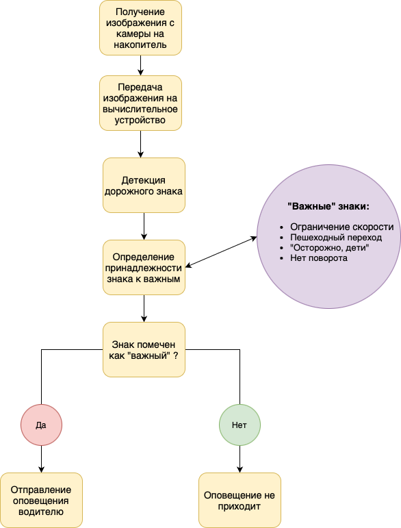

# Система автоматического распознавания знаков на дороге

## Описание проекта
Данный проект нацелен на разработку и внедрение технологий компьютерного зрения для обеспечения безопасности дорожного движения. Проект предоставит решение для выявления и оповещения о наличии на дороге знаков пешеходного перехода, снижения скорости, ограничениям поведения вождения, что способствует уменьшению количества аварий, нарушений правил дорожного движения и несчастных случаев на дороге. Разработанный пайплайн способен распознавать знаки на дороге, предупреждая водителя о том, что поведение вождения должно измениться в соответствии со знаком.
## Цели проекта
- Увеличение безопасности для пешеходов и водителей.
- Предотвращение дорожных происшествий, связанных с игнорированием знаков ПДД или плохим расположением знака вне поля зрения водителя.
- Разработка системы, которая работает при ограниченной видимости и в различных погодных условиях.
## Business values
Наш проект представляет собой значительное количество потенциальных бизнес-ценностей:
1. Увеличение безопасности: Улучшение безопасности дорожного движения - это одно из важнейших бизнес-значений. Эта система может снизить количество аварий и наездов на пешеходов, что в свою очередь снизит юридические и финансовые риски для автопроизводителей, владельцев дорог и страховых компаний.
2. Репутация и бренд: Компании, разрабатывающие и внедряющие такие инновационные системы, могут укрепить свою репутацию и бренд, как заботливых и ответственных участников в сфере безопасности и технологических инноваций.
3. Улучшение клиентского опыта: Системы безопасности, внедренные в автомобили, улучшают общий клиентский опыт и комфорт вождения, что может привести к более лояльным клиентам и повторным покупкам.
4. Социальные и общественные выгоды: Повышение безопасности дорожного движения также способствует общественному благополучию, уменьшая травматизм и смертность на дорогах, что может привлечь поддержку со стороны государственных органов и общественности.
5. Возможности для дополнительных услуг: Компании могут предлагать дополнительные услуги и обновления для своих систем распознавания пешеходов, что может приносить дополнительные доходы.

Итак, проект по распознаванию знаков на дороге обладает значительным бизнес-потенциалом, предлагая ряд преимуществ, связанных с безопасностью, репутацией  и удовлетворением клиентов, а также социальными и общественными выгодами.

### Бизнес-метрики:
- Точность распознавания (количество корректно распознанных знаков) : Измеряет, насколько точно приложение распознает дорожные знаки. Эта метрика напрямую связана с эффективностью системы и безопасностью на дороге.

- Скорость распознавания (задержка в милисекундах между детекцией знака и воспроизведением оповещения) : Оценивает, насколько быстро система способна обнаруживать и классифицировать дорожные знаки. Высокая скорость может быть важной, если водитель не соблюдает скоростной режим там, где это положено, и с помощью датчика успел бы снизить скорость на соответствующем участке.

- Надежность (количество распознанных знаков в условиях ухудшенной видимости) : Показатель стабильности работы системы в различных условиях, таких как плохая погода, недостаточное освещение, и уровень загрязнения лобового стекла. Надежность важна для обеспечения постоянной работоспособности системы оповещений.

## Структура репозитория
- `src` - исходники проекта;
    - `cfg` - конфигурационные файлы проекта;
        - `models_configs` - конфигурационные файлы DL-моделей;
            - `samples` - примеры конфигураций моделей;
    - `pipeline` - пайплайн сегментация+детекция;
    - `weights` - основные версии DL-моделей в различных форматах, подобранные в ходе экспериментов;
        - `model name` - основная директория модели;
            - `task type` - segmentation/detection - тип модели;
    - `utils` - различные инструменты;
- `docs` - документация и справочная информация по проекту;
- `requirements.txt` - необходимые для работы приложения Python-библиотеки;

## Ограничения
[Ограничения](./docs/restrictions.md)

## Данные
Для детекции использовался датасет in progress

[Требования к данным для детекции](./docs/requirements.md)

[Инструкция для разметчиков](./docs/labeling_instruction.md)

[Расчет стоимости](./docs/cost_image.png)

## Общий пайплайн

## Примеры
### Детекция нескольких знаков
link

### Кривая Precision-Recall:

Данная метрика выбрана ввиду того, что высокий уровень mAP@50 в датчике детекции знаков дорожного движения может привести к улучшению безопасности на дорогах, обеспечив более точное и надежное распознавание дорожных знаков. Это в свою очередь может снизить риск дорожных происшествий и улучшить общую проходимость дороги, что имеет прямое воздействие на бизнес, особенно в сферах, где безопасность и эффективность движения играют ключевую роль, например, в сфере транспортной логистики. Кроме того, точные данные по обнаружению знаков могут повысить эффективность систем управления транспортным потоком и внести вклад в общественные и коммерческие инициативы по повышению безопасности на дорогах.

