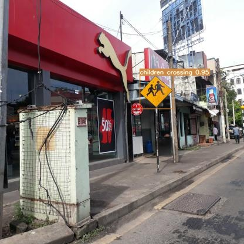
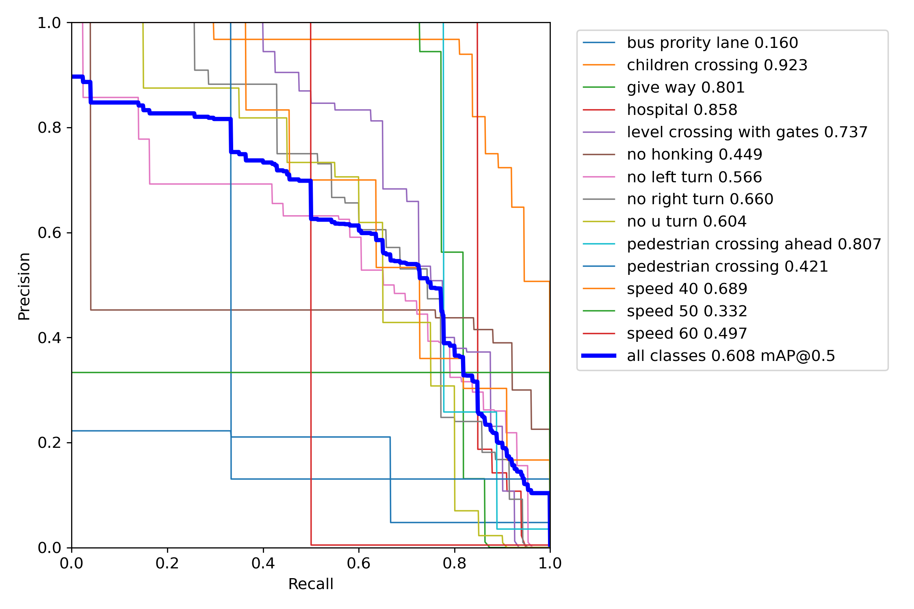

# Система автоматического распознавания знаков на дороге

## Описание проекта
Данный проект нацелен на разработку и внедрение технологий компьютерного зрения для обеспечения безопасности дорожного движения. Проект предоставит решение для выявления и оповещения о наличии на дороге знаков пешеходного перехода, снижения скорости, ограничениям поведения вождения, что способствует уменьшению количества аварий, нарушений правил дорожного движения и несчастных случаев на дороге. Разработанный пайплайн способен распознавать знаки на дороге, предупреждая водителя о том, что поведение вождения должно измениться в соответствии со знаком.
## Цели проекта
- Увеличение безопасности для пешеходов и водителей.
- Предотвращение дорожных происшествий, связанных с игнорированием знаков ПДД или плохим расположением знака вне поля зрения водителя.
- Разработка системы, которая работает при ограниченной видимости и в различных погодных условиях.
## Business values
Наш проект представляет собой значительное количество потенциальных бизнес-ценностей:
1. Увеличение безопасности: Улучшение безопасности дорожного движения - это одно из важнейших бизнес-значений. Эта система может снизить количество аварий и наездов на пешеходов, что в свою очередь снизит юридические и финансовые риски для автопроизводителей, владельцев дорог и страховых компаний.
2. Репутация и бренд: Компании, разрабатывающие и внедряющие такие инновационные системы, могут укрепить свою репутацию и бренд, как заботливых и ответственных участников в сфере безопасности и технологических инноваций.
3. Улучшение клиентского опыта: Системы безопасности, внедренные в автомобили, улучшают общий клиентский опыт и комфорт вождения, что может привести к более лояльным клиентам и повторным покупкам.
4. Социальные и общественные выгоды: Повышение безопасности дорожного движения также способствует общественному благополучию, уменьшая травматизм и смертность на дорогах, что может привлечь поддержку со стороны государственных органов и общественности.
5. Возможности для дополнительных услуг: Компании могут предлагать дополнительные услуги и обновления для своих систем распознавания пешеходов, что может приносить дополнительные доходы.

Итак, проект по распознаванию знаков на дороге обладает значительным бизнес-потенциалом, предлагая ряд преимуществ, связанных с безопасностью, репутацией  и удовлетворением клиентов, а также социальными и общественными выгодами.

## Структура репозитория
In progress

## Ограничения
[Ограничения](link)

## Данные
Для детекции использовался датасет in progress

[Требования к данным для детекции](link)

[Инструкция для разметчиков](link)

[Расчет стоимости](link)

## Примеры
### Детекция нескольких знаков
link

### Кривая Precision-Recall:

