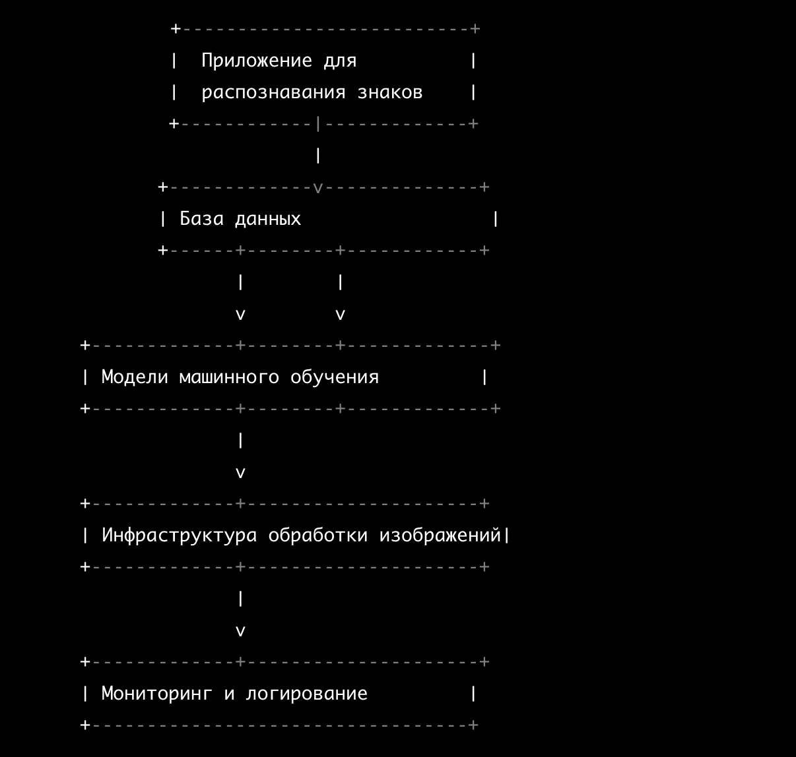

# Система автоматического распознавания знаков на дороге

## Описание проекта
Данный проект нацелен на разработку и внедрение технологий компьютерного зрения для обеспечения безопасности дорожного движения. Проект предоставит решение для выявления и оповещения о наличии на дороге знаков пешеходного перехода, снижения скорости, ограничениям поведения вождения, что способствует уменьшению количества аварий, нарушений правил дорожного движения и несчастных случаев на дороге. Разработанный пайплайн способен распознавать знаки на дороге, предупреждая водителя о том, что поведение вождения должно измениться в соответствии со знаком.
## Цели проекта
- Увеличение безопасности для пешеходов и водителей.
- Предотвращение дорожных происшествий, связанных с игнорированием знаков ПДД или плохим расположением знака вне поля зрения водителя.
- Разработка системы, которая работает при ограниченной видимости и в различных погодных условиях.
## Business values
Наш проект представляет собой значительное количество потенциальных бизнес-ценностей:
1. Увеличение безопасности: Улучшение безопасности дорожного движения - это одно из важнейших бизнес-значений. Эта система может снизить количество аварий и наездов на пешеходов, что в свою очередь снизит юридические и финансовые риски для автопроизводителей, владельцев дорог и страховых компаний.
2. Репутация и бренд: Компании, разрабатывающие и внедряющие такие инновационные системы, могут укрепить свою репутацию и бренд, как заботливых и ответственных участников в сфере безопасности и технологических инноваций.
3. Улучшение клиентского опыта: Системы безопасности, внедренные в автомобили, улучшают общий клиентский опыт и комфорт вождения, что может привести к более лояльным клиентам и повторным покупкам.
4. Социальные и общественные выгоды: Повышение безопасности дорожного движения также способствует общественному благополучию, уменьшая травматизм и смертность на дорогах, что может привлечь поддержку со стороны государственных органов и общественности.
5. Возможности для дополнительных услуг: Компании могут предлагать дополнительные услуги и обновления для своих систем распознавания пешеходов, что может приносить дополнительные доходы.

Итак, проект по распознаванию знаков на дороге обладает значительным бизнес-потенциалом, предлагая ряд преимуществ, связанных с безопасностью, репутацией  и удовлетворением клиентов, а также социальными и общественными выгодами.

### Бизнес-метрики:
- Точность распознавания (количество корректно распознанных знаков) : Измеряет, насколько точно приложение распознает дорожные знаки. Эта метрика напрямую связана с эффективностью системы и безопасностью на дороге.

- Скорость распознавания (задержка в милисекундах между детекцией знака и воспроизведением оповещения) : Оценивает, насколько быстро система способна обнаруживать и классифицировать дорожные знаки. Высокая скорость может быть важной, если водитель не соблюдает скоростной режим там, где это положено, и с помощью датчика успел бы снизить скорость на соответствующем участке.

- Надежность (количество распознанных знаков в условиях ухудшенной видимости) : Показатель стабильности работы системы в различных условиях, таких как плохая погода, недостаточное освещение, и уровень загрязнения лобового стекла. Надежность важна для обеспечения постоянной работоспособности системы оповещений.

## Структура репозитория
- `cfg` - конфигурационные файлы проекта;
- `samples` - примеры изображений и метрик;
- `test_images` - изображения для теста;
- `code_&_image_results` - основные версии DL-моделей, подобранные в ходе экспериментов;
- `labels_text` - вариации зависимой переменной;
- `docs` - документация и справочная информация по проекту;
- `requirements.txt` - необходимые для работы приложения Python-библиотеки;

## Ограничения
[Ограничения](./docs/restrictions.md)

## Данные
Для детекции использовался датасет in progress

[Требования к данным для детекции](./docs/requirements.md)

[Инструкция для разметчиков](./docs/labeling_instruction.md)

[Расчет стоимости](./docs/cost_image.png)

## Общий пайплайн

## Примеры
### Детекция нескольких знаков

### Кривая Precision-Recall:

Данная метрика выбрана ввиду того, что высокий уровень mAP@50 в датчике детекции знаков дорожного движения может привести к улучшению безопасности на дорогах, обеспечив более точное и надежное распознавание дорожных знаков. Это в свою очередь может снизить риск дорожных происшествий и улучшить общую проходимость дороги, что имеет прямое воздействие на бизнес, особенно в сферах, где безопасность и эффективность движения играют ключевую роль, например, в сфере транспортной логистики. Кроме того, точные данные по обнаружению знаков могут повысить эффективность систем управления транспортным потоком и внести вклад в общественные и коммерческие инициативы по повышению безопасности на дорогах.

## Сравнение результатов моделей
YOLOv3:  

YOLOv4:  
  
Видно, что модель YOLOv4 имеет меньшее время выполнения, чем модель YOLOv3, и генерирует больше информации о разметке.

## Улучшение пайплайна работы
- Оптимизация алгоритмов обработки изображений:
  Новые архитектуры Yolov8 или YoloR будут "из коробки" более эффективные, но более затратны с точки зрения вычислительных ресурсов. При наличии более сильного вычислительного центра, можно использовать более современные и точные архитектуры, которые дадут прирост качества.
- Сбор и использование разнообразных и обширных наборов данных для обучения моделей, что может улучшить их точность и обобщающую способность.
  Для того, чтобы обогатить исходный датасет, можно воспользоваться сервисами по типу Яндекс.Толока или размечать изображения самостоятельно.
- Использование технологии передачи обучения (transfer learning):
  Перенос знаний от моделей, обученных на похожих задачах, может существенно ускорить процесс обучения и улучшить производительность.
- Использование аппаратного ускорения, такого как графические процессоры (GPU) или тензорные процессоры (TPU), чтобы ускорить вычисления глубокого обучения.
- Кэширование и предварительная обработка данных:
  Использование кэширования для хранения предварительно обработанных изображений и результатов, чтобы уменьшить время ответа на запросы.
- Облачные вычисления:
  Использование облачных вычислений для масштабируемости и гибкости. Облачные платформы, такие как AWS, Azure или Google Cloud, предоставляют ресурсы для развертывания и масштабирования сервисов компьютерного зрения.
- Мониторинг и оптимизация производительности: Регулярные мониторинг производительности системы и оптимизация кода и инфраструктуры для обеспечения эффективной работы на больших объемах данных.
- Распределенные системы: Использование распределенных вычислений для обработки больших объемов данных параллельно, что позволяет улучшить скорость обработки.

## Масштабирование сервиса
1. Основные компоненты:
- Приложение для распознавания дорожных знаков:
  - Описание: Обрабатывает входные запросы, содержащие изображения дорожных знаков, и возвращает результаты распознавания.
  - Масштабирование: Горизонтальное масштабирование для управления большим количеством одновременных запросов.
- База данных:
  - Описание: Хранит обученные модели, предварительно обработанные изображения и другие необходимые данные.
  - Масштабирование: Вертикальное масштабирование или использование распределенных баз данных при увеличении размеров данных.
- Модели компьютерного зрения:
  - Описание: Содержит обученные модели для распознавания дорожных знаков.
  - Масштабирование: Использование технологии передачи обучения, кэширование результатов предыдущих запросов, автоматизированное обновление моделей.
- Инфраструктура обработки изображений:
  - Описание: Обеспечивает вычислительные ресурсы для обработки изображений.
  - Масштабирование: Использование облачных вычислений, автоматическое горизонтальное масштабирование с использованием контейнеризации и оркестрации (например, Kubernetes).
- Мониторинг и логирование:
  - Описание: Отслеживает производительность системы и регистрирует события для анализа.
  - Масштабирование: Использование специализированных инструментов мониторинга и логирования.
2. Стратегии масштабирования:
- Вертикальное масштабирование:
  - Увеличение вычислительных ресурсов (CPU, RAM) на существующих серверах.
- Горизонтальное масштабирование:
  - Добавление новых серверов для распределения нагрузки.
- Облачные вычисления:
  - Использование облачных сервисов для масштабирования ресурсов по требованию.
- Контейнеризация и оркестрация:
  - Использование технологий, таких как Docker и Kubernetes, для автоматического управления контейнерами и горизонтального масштабирования.
- CDN (Content Delivery Network):
  - Использование CDN для распределения контента и уменьшения задержек при обработке изображений.
3. Автоматизация и управление:
- Автоматическое масштабирование:
  - Настройка автоматического масштабирования с использованием инструментов, таких как Auto Scaling (например, в облачных платформах).
- Управление версиями моделей:
  - Разработка системы управления версиями моделей для безопасного обновления и внедрения новых функций.
4. Безопасность:
- Реализация мер безопасности для защиты данных, обработка изображений и моделей компьтерного зрения.

